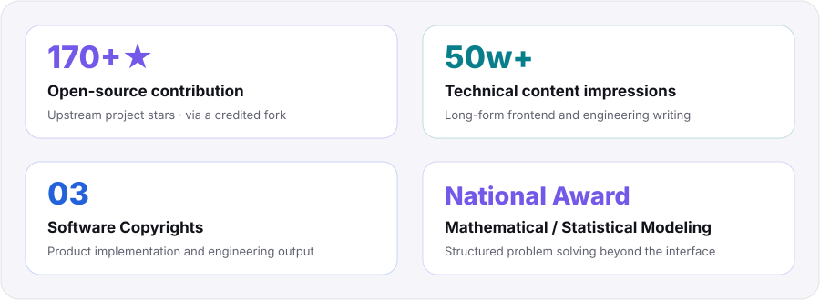
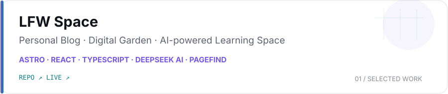
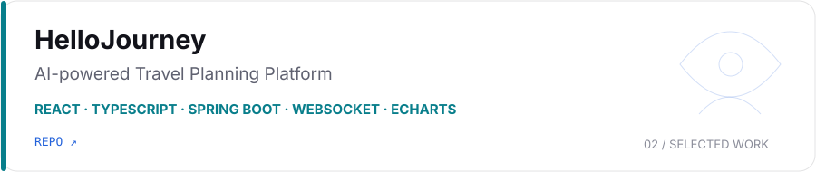
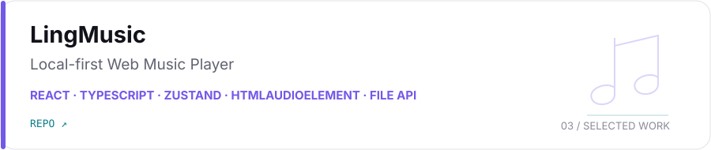
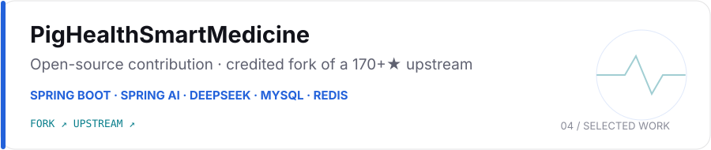
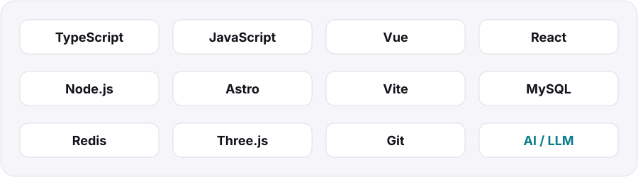

<picture>
  <source media="(prefers-color-scheme: dark)" srcset="./assets/hero-dark.svg" />
  <source media="(prefers-color-scheme: light)" srcset="./assets/hero-light.svg" />
  
</picture>

  <a href="https://liufengwei-personal-blog.vercel.app/">Blog</a>&nbsp;&nbsp;·&nbsp;&nbsp;
  <a href="https://juejin.cn/user/2826210963370939">Juejin</a>&nbsp;&nbsp;·&nbsp;&nbsp;
  <a href="https://github.com/kdjfs">GitHub</a>&nbsp;&nbsp;·&nbsp;&nbsp;
  <a href="mailto:lfw2663040734@qq.com">Email</a>

## Focus

专注 Vue / React / TypeScript 的前端工程化与复杂交互，同时探索 Node.js、AI Agent、RAG 与现代 AI 应用开发。

喜欢把技术真正做成可以运行、可以演示、可以长期维护的产品。

`Frontend Engineering` → `Product & Cross-platform` → `AI Applications` → `Open Source & Writing`

## Highlights

<picture>
  <source media="(max-width: 520px) and (prefers-color-scheme: dark)" srcset="./assets/highlights-mobile-dark.svg" />
  <source media="(max-width: 520px) and (prefers-color-scheme: light)" srcset="./assets/highlights-mobile-light.svg" />
  <source media="(prefers-color-scheme: dark)" srcset="./assets/highlights-dark.svg" />
  <source media="(prefers-color-scheme: light)" srcset="./assets/highlights-light.svg" />
  
</picture>

<strong>170+★</strong> refers to the <a href="https://github.com/linyshdhhcb/PigHealthSmartMedicine">upstream open-source project</a>; my contribution is presented through a credited fork.

## Selected Work

<a href="https://liufengwei-personal-blog.vercel.app/">
  <picture>
    <source media="(prefers-color-scheme: dark)" srcset="./assets/projects/lfw-space-dark.svg" />
    <source media="(prefers-color-scheme: light)" srcset="./assets/projects/lfw-space-light.svg" />
    
  </picture>
</a>

<a href="https://github.com/kdjfs/liufengwei-personal-blog">Repository</a> · <a href="https://liufengwei-personal-blog.vercel.app/">Live</a>

<a href="https://github.com/kdjfs/HelloJourney">
  <picture>
    <source media="(prefers-color-scheme: dark)" srcset="./assets/projects/hello-journey-dark.svg" />
    <source media="(prefers-color-scheme: light)" srcset="./assets/projects/hello-journey-light.svg" />
    
  </picture>
</a>

<a href="https://github.com/kdjfs/HelloJourney">Repository</a>

<a href="https://github.com/kdjfs/ling-music">
  <picture>
    <source media="(prefers-color-scheme: dark)" srcset="./assets/projects/ling-music-dark.svg" />
    <source media="(prefers-color-scheme: light)" srcset="./assets/projects/ling-music-light.svg" />
    
  </picture>
</a>

<a href="https://github.com/kdjfs/ling-music">Repository</a>

<a href="https://github.com/kdjfs/PigHealthSmartMedicine">
  <picture>
    <source media="(prefers-color-scheme: dark)" srcset="./assets/projects/pig-health-dark.svg" />
    <source media="(prefers-color-scheme: light)" srcset="./assets/projects/pig-health-light.svg" />
    
  </picture>
</a>

<a href="https://github.com/kdjfs/PigHealthSmartMedicine">Fork</a> · <a href="https://github.com/linyshdhhcb/PigHealthSmartMedicine">Upstream</a>

## Core Stack

<picture>
  <source media="(max-width: 520px) and (prefers-color-scheme: dark)" srcset="./assets/stack-mobile-dark.svg" />
  <source media="(max-width: 520px) and (prefers-color-scheme: light)" srcset="./assets/stack-mobile-light.svg" />
  <source media="(prefers-color-scheme: dark)" srcset="./assets/stack-dark.svg" />
  <source media="(prefers-color-scheme: light)" srcset="./assets/stack-light.svg" />
  
</picture>

## GitHub Activity

<picture>
  <source media="(max-width: 520px) and (prefers-color-scheme: dark)" srcset="https://raw.githubusercontent.com/kdjfs/kdjfs/output/activity-mobile-dark.svg" />
  <source media="(max-width: 520px) and (prefers-color-scheme: light)" srcset="https://raw.githubusercontent.com/kdjfs/kdjfs/output/activity-mobile-light.svg" />
  <source media="(prefers-color-scheme: dark)" srcset="https://raw.githubusercontent.com/kdjfs/kdjfs/output/activity-dark.svg" />
  <source media="(prefers-color-scheme: light)" srcset="https://raw.githubusercontent.com/kdjfs/kdjfs/output/activity-light.svg" />
  
</picture>

## Contribution Snake

<picture>
  <source media="(prefers-color-scheme: dark)" srcset="https://raw.githubusercontent.com/kdjfs/kdjfs/output/github-contribution-grid-snake-dark.svg" />
  <source media="(prefers-color-scheme: light)" srcset="https://raw.githubusercontent.com/kdjfs/kdjfs/output/github-contribution-grid-snake.svg" />
  
</picture>

## Latest Writing

- [8.6 亚信科技和nemo video二面面经](https://liufengwei-personal-blog.vercel.app/blog/8-6-ya-xin-ke-ji-he-nemo-video-er-mian-mian-jing/) — 面经 · 2026-08-06
- [8.5号 nemovideo（tiktok前身）和水木面经](https://liufengwei-personal-blog.vercel.app/blog/8-5-hao-nemovideo-tiktok-qian-shen-he-shui-mu-mian-jing/) — 面经 · 2026-08-05
- [8.4 四家面试](https://liufengwei-personal-blog.vercel.app/blog/8-4-si-jia-mian-shi/) — 面经 · 2026-08-04

[View all posts → LFW Space](https://liufengwei-personal-blog.vercel.app/blog/)

  <a href="https://liufengwei-personal-blog.vercel.app/"><strong>知行合一 · Build. Ship. Reflect.</strong></a>

