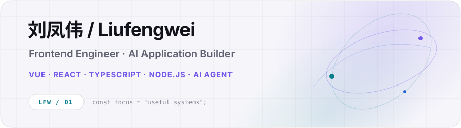

<picture>
  <source media="(prefers-color-scheme: dark)" srcset="./assets/hero-dark.svg" />
  <source media="(prefers-color-scheme: light)" srcset="./assets/hero-light.svg" />
  
</picture>

  <a href="https://liufengwei-personal-blog.vercel.app/">Blog</a>&nbsp;&nbsp;·&nbsp;&nbsp;
  <a href="https://juejin.cn/user/2826210963370939">Juejin</a>&nbsp;&nbsp;·&nbsp;&nbsp;
  <a href="https://github.com/kdjfs">GitHub</a>&nbsp;&nbsp;·&nbsp;&nbsp;
  <a href="mailto:lfw2663040734@qq.com">Email</a>

## Contribution Snake

<picture>
  <source media="(prefers-color-scheme: dark)" srcset="https://raw.githubusercontent.com/kdjfs/kdjfs/output/github-contribution-grid-snake-dark.svg" />
  <source media="(prefers-color-scheme: light)" srcset="https://raw.githubusercontent.com/kdjfs/kdjfs/output/github-contribution-grid-snake.svg" />
  
</picture>

